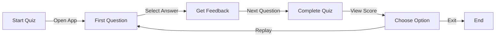

<!--
  README.md for Quiz App With Fixed Time
  Author: Gouranga Das Samrat
  License: MIT
-->

<div align="center">

# 🎯 Quiz App With Fixed Time ⏱️

[](https://choosealicense.com/licenses/mit/)
[](https://html.spec.whatwg.org/)
[](https://www.w3.org/Style/CSS/)
[](https://developer.mozilla.org/en-US/docs/Web/JavaScript)
[](https://app.netlify.com/projects/quizappbygouranga/deploys)
[](https://github.com/GourangaDasSamrat/Quiz-App-With-Fixed-Time/graphs/commit-activity)
[](https://github.com/GourangaDasSamrat/Quiz-App-With-Fixed-Time/stargazers)
[](http://makeapullrequest.com)


<h3>A modern, responsive quiz application. Test your knowledge with a fixed timer and get instant feedback! 🧠</h3>

<p>
  <a href="https://quizappbygouranga.netlify.app/">🌐 Live Demo</a> ·
  <a href="https://github.com/GourangaDasSamrat/Quiz-App-With-Fixed-Time/issues">🐞 Report Bug</a> ·
  <a href="https://github.com/GourangaDasSamrat/Quiz-App-With-Fixed-Time/issues">✨ Request Feature</a>
</p>

</div>

---

<div align="center">

## ⚡ Try it now: [Quiz App With Fixed Time ⏱️](https://quizappbygouranga.netlify.app/)

</div>

---

## 🎬 Demo & Preview

<div align="center">

### 📹 Demo Video

[Screencast from 2025-06-06 11-11-39.webm](https://github.com/user-attachments/assets/81517af1-e49f-4f84-933c-3a3361cc66f0)


</div>

---

## ✨ Key Features

| 🚀 Feature           | 💡 Description                                        |
| -------------------- | ----------------------------------------------------- |
| 📱 Responsive Design | Seamless experience on any device                     |
| ✅ Instant Feedback  | Visual cues for correct/incorrect answers             |
| ⏱️ Timed Questions   | Challenge yourself with a countdown timer             |
| 🎯 Progress Tracking | Clean, intuitive interface to monitor your progress   |
| 🔄 Quick Replay      | Instantly restart and try to beat your previous score |

---

## 🛠️ Tech Stack

| Category        | Technologies                                                                                                                                                                                                                                                                              |
| --------------- | ----------------------------------------------------------------------------------------------------------------------------------------------------------------------------------------------------------------------------------------------------------------------------------------- |
| Frontend        |    |
| Icons           |                                                                                                                                                                              |
| Deployment      |                                                                                                                                                                                            |
| Version Control |                                                                                                            |

---

## 🏗️ Project Structure

```bash
Quiz-App-With-Fixed-Time/
├── index.html              # Main HTML file
├── style.css               # Global styles
├── js/
│   ├── script.js           # Main application logic
│   └── question.js         # Question data and logic
├── img/
│   ├── favcon.png          # Favicon
│   ├── Question.svg        # Question illustration
│   └── winner.svg          # Winner illustration
└── fontawesome/            # Icon library
    ├── css/
    └── webfonts/
```

---

## 📊 Performance Metrics

<div align="center">

### 🎯 Lighthouse Scores

| Category       | Score   | Badge                                                                               |
| -------------- | ------- | ----------------------------------------------------------------------------------- |
| Performance    | 98/100  |           |
| Accessibility  | 100/100 |      |
| Best Practices | 100/100 |  |
| SEO            | 100/100 |                          |

### ⚡ PageSpeed Insights

- ⚡ First Contentful Paint: 0.8s
- 🎯 Time to Interactive: 1.2s
- 📱 Mobile Score: 95/100
- 💻 Desktop Score: 98/100

</div>

---

## 🎮 User Guide

### Quick Start Flow



### 📝 Step-by-Step Instructions

1. **Starting the Quiz**: Launch the quiz and click 'Start Quiz'. Timer starts automatically.
2. **Answering Questions**: Select your answer and get instant feedback.
3. **Getting Feedback**: Green for correct, red for incorrect, with explanations.
4. **Completing the Quiz**: View your score, replay, or exit.

### 🎯 Pro Tips

- Take your time reading each question
- Watch the timer to pace yourself
- Review explanations to learn from mistakes
- Try beating your previous scores

---

## 🚀 Getting Started

### Quick Setup Options

| 🌐 Online Demo                                           | 💻 Local Setup           |
| -------------------------------------------------------- | ------------------------ |
| [Launch App Now](https://quizappbygouranga.netlify.app/) | Follow setup steps below |
| No installation needed                                   | Full source code access  |
| Instant access                                           | Customizable             |

### 🔧 Local Development Setup

1. Download ZIP or clone the repo
2. Extract files
3. Open `index.html` in your browser

```bash
# Clone the repository
git clone https://github.com/GourangaDasSamrat/Quiz-App-With-Fixed-Time.git

# Navigate to project
cd Quiz-App-With-Fixed-Time

# Open in browser
xdg-open index.html  # Linux
# or just double-click index.html
```

---

## 📜 License

This project is licensed under the [MIT License](https://opensource.org/licenses/MIT).

### Limitations:

- ❌ Warranty
- ❌ Liability

### Conditions:

- 📝 License and copyright notice included
  You are free to use, modify, and distribute this Quiz App for both commercial and non-commercial purposes. See the LICENSE file for complete license terms.

---

## 🚀 GitHub

Feel free to contribute, fork, and use this project! If you have any suggestions or find any issues, please open an issue or pull request on the GitHub repository. 🙏

---

## 👤 Author & Contact

<div align="center">
  
</div>

<p align="center">
  <b>Gouranga Das Samrat</b><br>
  <i>Frontend Developer | JavaScript & React Expert | Open Source Enthusiast</i>
</p>

<p align="center">
  <a href="https://github.com/GourangaDasSamrat" title="GitHub"></a>
  <a href="https://linkedin.com/in/gouranga-das-samrat" title="LinkedIn"></a>
  <a href="https://gouranga-das.netlify.app/" title="Portfolio"></a>
  <a href="mailto:gouranga.das.khulna@gmail.com" title="Email"></a>
  <a href="https://leetcode.com/u/gourangadassamrat/" title="LeetCode"></a>
  <a href="https://codepen.io/gouranga-das-samrat" title="CodePen"></a>
  <a href="https://www.reddit.com/user/Capable-Plantain8709/" title="Reddit"></a>
  <a href="https://www.behance.net/gourangsamrat" title="Behance"></a>
  <a href="https://dribbble.com/gourangadassamrat" title="Dribbble"></a>
  <a href="https://stackoverflow.com/users/27733996/gouranga-das-samrat?tab=profile" title="Stack Overflow"></a>
  <a href="https://www.quora.com/profile/Gouranga-Das-Samrat" title="Quora"></a>
  <a href="https://www.twitch.tv/gourangadassamrat" title="Twitch"></a>
  <a href="https://www.youtube.com/@GourangaDasSamrat" title="YouTube"></a>
  <a href="https://medium.com/@gouranga.das.khulna" title="Medium"></a>
  <a href="https://gourangadassamrat.blogspot.com/" title="Blogger"></a>
  <a href="https://discord.gg/jnZStfKW7v" title="Discord"></a>
  <a href="https://x.com/gouranga_khulna" title="X"></a>
  <a href="https://www.facebook.com/gourangadassamrat" title="Facebook"></a>
  <a href="https://instagram.com/gouranga.das.khulna" title="Instagram"></a>
  <a href="https://www.tiktok.com/@gourangadassamrat" title="TikTok"></a>
  <a href="https://www.threads.net/@gouranga.das.khulna" title="Threads"></a>
  <a href="https://pinterest.com/gourangadaskhulna" title="Pinterest"></a>
</p>

<p align="center">
  <i>Let's connect! I'm always open to collaboration, frontend projects, or just a friendly chat about JavaScript and React.</i>
</p>

---

## 🌟 Show Your Support

If you like this project, please give it a ⭐ on GitHub!

---

## 📢 Feedback

Have suggestions or want to contribute? Feel free to open an issue or reach out to me through my social profiles.

**Happy Programming!**
