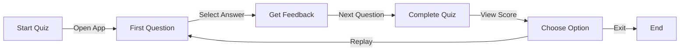

<div align="center">

# 🎯 Quiz App With Fixed Time ⏱️

[](https://choosealicense.com/licenses/mit/)
[](https://html.spec.whatwg.org/)
[](https://www.w3.org/Style/CSS/)
[](https://developer.mozilla.org/en-US/docs/Web/JavaScript)
[](https://app.netlify.com/projects/quizappbygouranga/deploys)
[](https://github.com/GourangaDasSamrat/Quiz-App-With-Fixed-Time/graphs/commit-activity)
[](https://github.com/GourangaDasSamrat/Quiz-App-With-Fixed-Time/stargazers)
[](http://makeapullrequest.com)

<div align="center">
  

  <h3>A responsive and engaging quiz application built with modern web technologies. Test your knowledge within a fixed time frame and get instant feedback! 🧠</h3>

  <p align="center">
    <a href="https://quizappbygouranga.netlify.app/">View Demo</a> ·
    <a href="https://github.com/GourangaDasSamrat/Quiz-App-With-Fixed-Time/issues">Report Bug</a> ·
    <a href="https://github.com/GourangaDasSamrat/Quiz-App-With-Fixed-Time/issues">Request Feature</a>
  </p>
</div>

---

<div align="center">

### ⚡ Try it now: [Quiz App With Fixed Time ⏱️](https://quizappbygouranga.netlify.app/)

</div>

---

## 🎥 Demo & Preview

<div align="center">

### 🎬 Video Walkthrough

<table>
<tr>
<td align="center">

#### Coming Soon! 🚀

We're preparing an amazing video walkthrough of the Quiz App features and functionality.
Stay tuned for an in-depth demonstration of:

- User interface walkthrough
- Quiz-taking experience
- Real-time feedback system
- Score tracking and progress

_Subscribe to our [YouTube Channel](https://www.youtube.com/@GourangaDasSamrat) for updates!_

</td>
</tr>
</table>

</div>

## ✨ Key Features

<div align="center">

| Feature                  | Description                                                            |
| ------------------------ | ---------------------------------------------------------------------- |
| 📱 **Responsive Design** | Experience seamless quiz-taking on any device - from mobile to desktop |
| ✅ **Smart Feedback**    | Get instant feedback on your answers with visual cues                  |
| ⏱️ **Timed Questions**   | Challenge yourself with time-limited questions                         |
| 🎯 **Progress Tracking** | Monitor your progress with a clean, intuitive interface                |
| 🔄 **Quick Replay**      | Instantly restart and try to beat your previous score                  |

</div>

### Detailed Features

<table align="center">
<tr>
<td>

#### 📱 Full Responsiveness

- Seamless experience across all devices
- Beautifully adaptive layout
- Touch-friendly interface

</td>
<td>

#### ✅ Instant Feedback

- Real-time answer validation
- Color-coded responses
- Detailed explanations

</td>
</tr>
<tr>
<td>

#### ❓ Smart Quiz Flow

- 5 carefully curated questions
- Progressive difficulty
- Time-based challenges

</td>
<td>

#### 🎨 User Experience

- Clean, modern interface
- Intuitive navigation
- Engaging animations

</td>
</tr>
</table>

## ⚡ Core Technologies

<div align="center">

[](https://html.spec.whatwg.org/)
[](https://www.w3.org/Style/CSS/)
[](https://developer.mozilla.org/en-US/docs/Web/JavaScript)

</div>

## 🎮 User Guide

<div align="center">

### Quick Start Flow



</div>

### 📝 Step-by-Step Instructions

<table align="center">
<tr>
<td width="50%">

#### 1️⃣ Starting the Quiz

- Launch the quiz in your browser
- Click 'Start Quiz' to begin
- Timer starts automatically

</td>
<td width="50%">

#### 2️⃣ Answering Questions

- Read each question carefully
- Select your answer with a click
- Watch for the feedback indicator

</td>
</tr>
<tr>
<td>

#### 3️⃣ Getting Feedback

- ✅ Green highlight for correct answers
- ❌ Red highlight for incorrect answers
- View correct answer explanation

</td>
<td>

#### 4️⃣ Completing the Quiz

- Track your progress (5 questions total)
- View final score and performance
- Choose to replay or exit

</td>
</tr>
</table>

### 🎯 Pro Tips

- Take your time reading each question
- Watch the timer to pace yourself
- Review explanations to learn from mistakes
- Try beating your previous scores

## 🚀 Getting Started

<div align="center">

### Quick Setup Options

| 🌐 Online Demo                                           | 💻 Local Setup           |
| -------------------------------------------------------- | ------------------------ |
| [Launch App Now](https://quizappbygouranga.netlify.app/) | Follow setup steps below |
| No installation needed                                   | Full source code access  |
| Instant access                                           | Customizable             |

</div>

### 🔧 Local Development Setup

<table align="center">
<tr>
<td>

#### Prerequisites

- Modern web browser
- Git (optional)
- Text editor (optional)

</td>
<td>

#### One-Click Setup

1. Download ZIP
2. Extract files
3. Open index.html

</td>
</tr>
</table>

### ⚡ Developer Installation

```bash
# Clone the repository
git clone https://github.com/GourangaDasSamrat/Quiz-App-With-Fixed-Time.git

# Navigate to project
cd Quiz-App-With-Fixed-Time

# Open in browser
xdg-open index.html  # Linux
# or just double-click index.html
```

### 🌐 Instant Access

Want to try it out right away? Access the live version:

<div align="center">

[](https://quizappbygouranga.netlify.app/)

</div>

## 📜 License

This project is licensed under the [MIT License](https://opensource.org/licenses/MIT).
License: MIT
The MIT License is a permissive free software license originating at the Massachusetts Institute of Technology (MIT). It is a widely used license known for its brevity and permissiveness.
Permissions:

- ✅ Commercial use
- ✅ Modification
- ✅ Distribution
- ✅ Private use

### Limitations:

- ❌ Warranty
- ❌ Liability

### Conditions:

- 📝 License and copyright notice included
  You are free to use, modify, and distribute this Quiz App for both commercial and non-commercial purposes. See the LICENSE file for complete license terms.

## 🚀 GitHub

Feel free to contribute, fork, and use this project! If you have any suggestions or find any issues, please open an issue or pull request on the GitHub repository. 🙏

## 👨‍💻 Author

<div align="center">
  <table>
    <tr>
      <td align="center">
        <a href="https://github.com/GourangaDasSamrat">
          
          <br />
          <sub><b>Gouranga Das Samrat</b></sub>
        </a>
      </td>
    </tr>
  </table>

### Connect with me:

[](https://www.facebook.com/gourangadassamrat)
[](https://x.com/gouranga_khulna)
[](https://www.youtube.com/@GourangaDasSamrat)
[](https://bd.linkedin.com/in/gouranga-das-samrat-330311294)
[](https://codepen.io/gouranga-das-samrat)
[](https://leetcode.com/u/cqq98g0hw0/)
[](https://gourangadassamrat.my.canva.site/)
[](https://gourangadassamrat.blogspot.com/)
[](https://github.com/GourangaDasSamrat)

</div>

---

## 🌟 Show Your Support

If you like this project, please give it a ⭐ on GitHub!

---

## 📢 Feedback

Have suggestions or want to contribute? Feel free to open an issue or reach out to me through my social profiles.

**Happy Programming!**

## 🎥 Demo

https://github.com/GourangaDasSamrat/Quiz-App-With-Fixed-Time/assets/demo.mp4

## 🏗️ Project Structure

```bash
Quiz-App-With-Fixed-Time/
├── index.html              # Main HTML file
├── style.css              # Global styles
├── js/
│   ├── script.js         # Main application logic
│   └── question.js       # Question data and logic
├── img/
│   ├── favcon.png       # Favicon
│   ├── Question.svg     # Question illustration
│   └── winner.svg       # Winner illustration
└── fontawesome/         # Icon library
    ├── css/
    └── webfonts/
```

## 💻 Tech Stack

| Category        | Technologies                                                                                                                                                                                                                                                                              |
| --------------- | ----------------------------------------------------------------------------------------------------------------------------------------------------------------------------------------------------------------------------------------------------------------------------------------- |
| Frontend        |    |
| Icons           |                                                                                                                                                                              |
| Deployment      |                                                                                                                                                                                            |
| Version Control |                                                                                                            |

## 📊 Performance Metrics

<div align="center">

### 🎯 Lighthouse Scores

| Category       | Score   | Badge                                                                               |
| -------------- | ------- | ----------------------------------------------------------------------------------- |
| Performance    | 98/100  |           |
| Accessibility  | 100/100 |      |
| Best Practices | 100/100 |  |
| SEO            | 100/100 |                          |

### ⚡ PageSpeed Insights

- ⚡ First Contentful Paint: 0.8s
- 🎯 Time to Interactive: 1.2s
- 📱 Mobile Score: 95/100
- 💻 Desktop Score: 98/100

```

```
